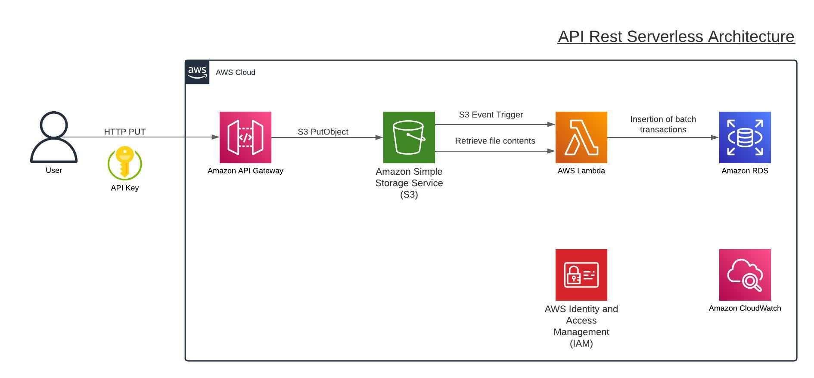

# Tuxpas Challenge

As a data engineer at Tuxpas, you're on the brink of undertaking a significant project
involving the migration of large amounts of data to a new database system. You are tasked
with developing a proof of concept that addresses the following requirements:

1. Transfer historical data from CSV files to the new database.
2. Develop a RESTful API service to handle incoming data, with the following considerations:
- Each incoming transaction must comply with data dictionary rules.
- Facilitate the insertion of batch transactions, from 1 to 1000 rows.
- Accept data for different tables through the same service.
- Remember to enforce specific data rules for each table.
3. An architectural diagram for the most optimal (not necessarily the one you will be
presenting) solution in an AWS environment using its cloud services.

## Solution: AWS Serverless RESTful API Architecture

### What I did?

I have implemented a robust Serverless RESTful API using Amazon API Gateway, serving as an endpoint to receive CSV files through PUT requests. Upon receiving the CSV files, they are securely stored in Amazon S3 for further processing.

To handle the data transformation and loading, I've designed a Lambda function that automatically triggers whenever a file is uploaded to the designated S3 bucket. This Lambda function performs the Extract, Transform, and Load (ETL) operations, ensuring data integrity and compliance with predefined data dictionary rules.

Before migrating the data to our MySQL database hosted on Amazon RDS, the Lambda function rigorously verifies the data integrity, discarding any transactions that fail to meet the required criteria. These discarded transactions are logged in Amazon CloudWatch for future reference, ensuring transparency and traceability.

Our ETL process enforces data dictionary rules, guaranteeing the consistency and validity of the data stored in the database. Additionally, the database has a well-configured setup that validates the integrity of data between its tables and fields, providing an additional layer of data quality assurance.

To ensure the security of our solution, we leverage Amazon IAM (Identity and Access Management) to control access to all the services within our architecture. Moreover, access to the API is protected by an API Key, restricting unauthorized access and maintaining data privacy.

With this architecture, we have built a scalable and secure solution for handling data ingestion, transformation, and storage, effectively ensuring high data integrity and reliability for our application.
